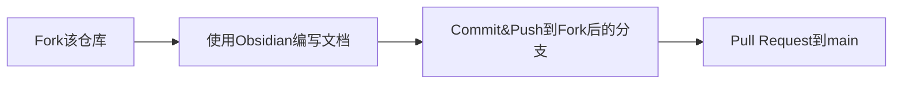

# CodeWheelCollector

>“每个艺术家都会积累他的素材库便于材料复用”      ——leoweyr

`CodeWheelCollector`是一个公开性致力于收录所有编程语言各种库、框架或社区自主实现底层性操作的每个具体函数或类文档的wiki类数据库。

秉持`不要重复造轮子`的理念。
- 希望能成为每个程序员的随身易用手册，目的于减少程序员查找库时从搜索引擎检索的成百上千个结果中挑选出自己所需要的花费的时间成本。
- 同时，也收录来源于非知名库而由社区自主实现的底层性操作代码，目的于通过社区的不断“递归”提高这些代码的精湛高效度和复用率，减少开发者在底层轮子上花费的时间成本，让开发者更加专注于上层建筑的开发中去。

灵感源自鲁班大叔_007做的查询Java类和储存Jar包的`Maven`网站

## 优势特点
- 基于Github实现社区共享型数据库形式，数据库内容永久开源免费
- 使用Obsidian浏览数据库内容，完美地快速检索到所需文档信息，反向链接反映不同文档之间可能存在的联系

>\#TODO：暂时以这种形式，未来将开发更加智能的同源多镜像同步共享型wiki类数据库软件，不仅收录文档还包括对应公开的源代码片段解析，以及贡献轨迹和分支的详细记录，支持多国语言编写和查看文档，还有非独断的社区共同审阅

## 如何使用
>数据库内容本身是免费的，但参与数据库编写和维护的贡献是无价的。为了持续良好的社区环境，希望您在克隆该数据库为镜像时保护好任何贡献信息，相信您一定是个好人

1. ⭐Star该仓库即您订阅了此仓库的更新
2. 下载Obsidian，这是一个Markdown文档库编写与浏览软件，包含桌面端和移动端
3. `git clone`该仓库到本地，用Obsidian打开本地仓库文件夹即可使用本数据库

## 参与贡献
### 基本流程
